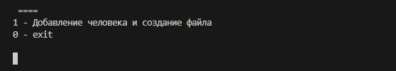
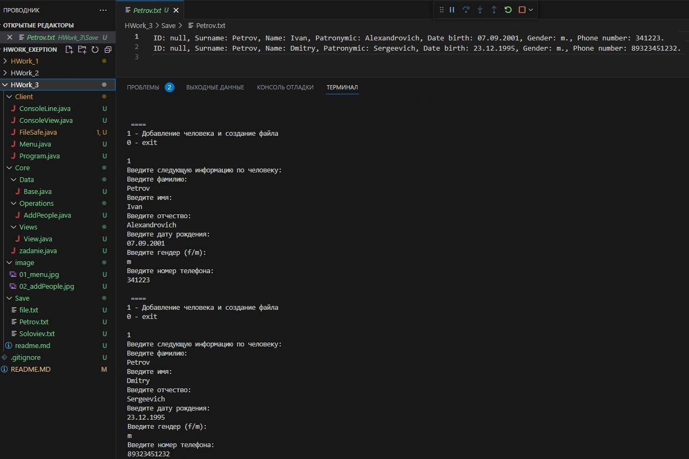
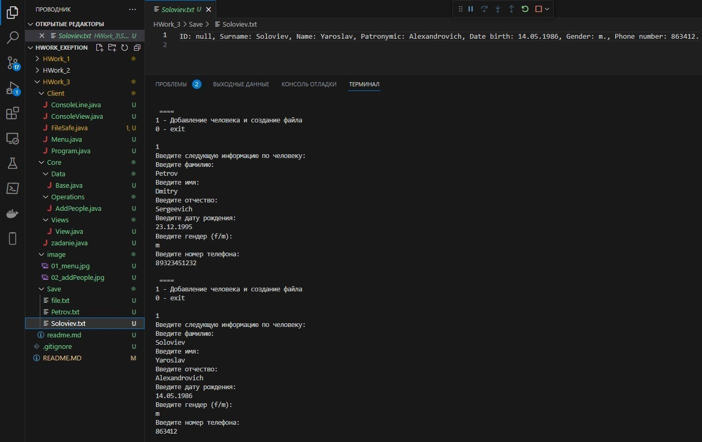
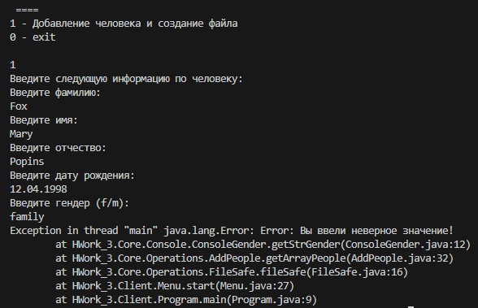
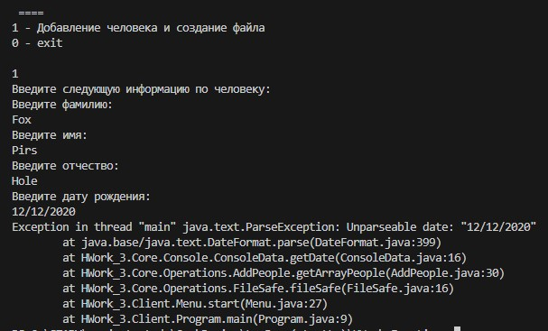
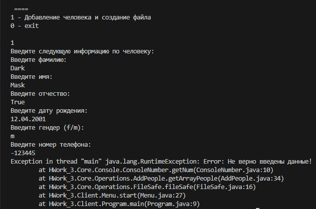

# Информационная система людей.
## I. Архитектура информационной системы:
1. Модуль интерфейса меню взаимодействия с пользователем (Client): состоит из интерфейса меню (Menu) и исполняемого файла (Program)
2. Модуль обработки информации (Core):
    - 2.1. Console:
    -  ConsoleData - метод проверки на ввод даты с консоли на ошибку
    -  ConsoleGender - метод проверки на ввод Gender (f/m)
    -  ConsoleLine - метод проверки на ввод пустой строки
    -  ConsoleNumber - метод проверки на ввод числа с консоли на ошибку
    -  ConsoleView - отвечает за вывод интерфейса меню
    - 2.2. Data: Base - родительский класс, включающий всю информацию по человеку (ID, Фамилия, Имя, Отчество, Дата рождения, Пол, Номер телефона)
    - 2.3. Operations:
    - AddPeople - отвечает за формирование информации по человеку в одном списке (ArrayList)
    - FileSafe - отвечает за запись информации по человеку в файл
    - 2.4. Views: View (модуль интерфейса меню)
3. Image - место хранения скриншотов выполнения программы
4. Save - место сохранения файлов в формате .txt с информацией по людям
5. readme - файл документации про программе

## II. Порядок работы:
1. Программа запускается из модуля Client/Program.java
2. Команды вводятся путем ввода с консоли цифры из выведенного на экран меню:
    - "1 - Добавление человека и создание файла"
    - "0 - Exit"
3. Функции информационной системы:
   1. Вывод меню программы
   - 
   2. Добавление информации о человеке и вывод данной информации в отдельный файл (если фамилии одинаковые, то - запись в один файл)
   - 
   - 
   - 
   3. Обработка исключения на ввод данных по человеку: если данные не введены -> выводится сообщение "Error: Строка пустая!"
   - Метод отвечающий за обработку данного исключения находится в файле Core/Consile/ConsoleLine.
   - 
   4. Обработка исключения на ввод данных по Gender: если введено ни "f", ни "m" -> выводится сообщение "Error: Вы ввели неверное значение!"
   - Метод отвечающий за обработку данного исключения находится в файле Core/Consile/ConsoleGender.
   - 
   5. Обработка исключения на ввод данных по Date: если введена дата не в формате "dd.MM.yyyy" -> выполнение программы прекращается с выводом соответствующей ошибки
   - Метод отвечающий за обработку данного исключения находится в файле Core/Consile/ConsoleData.
   - 
   6. Обработка исключения на ввод данных по Number: если введено не целое беззнаковое число -> выводится сообщение "Error: Не верно введены данные!"
   - Метод отвечающий за обработку данного исключения находится в файле Core/Consile/ConsoleNumber.
   - 
4. Программа закрывается путем ввода с консоли цифры 0, соответсвующей записи exit в меню
