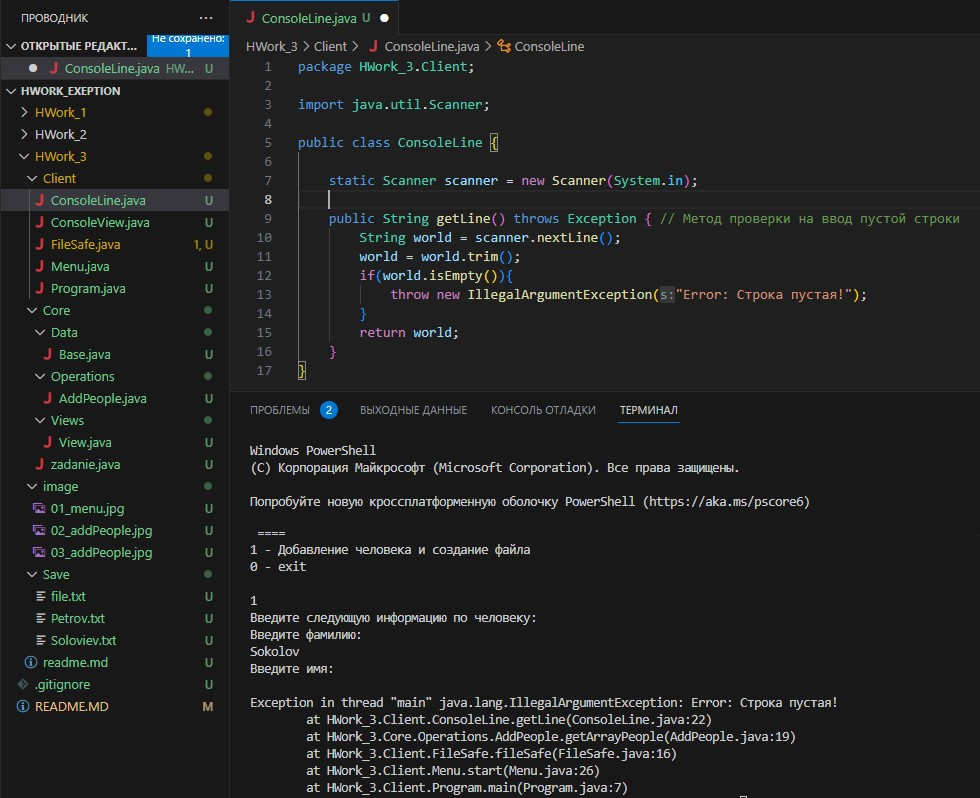

# Информационная система людей.
## I. Архитектура информационной системы:
1. Модуль интерфейса меню взаимодействия с пользователем (Client)
2. Модуль обработки информации (Core/Operation)
3. Класс база данных людей (Core/Data)

## II. Порядок работы:
1. Программа запускается из модуля Program.java
2. Команды вводятся путем ввода с консоли цифры из выведенного на экран меню:
    - "1 - Добавление человека и создание файла"
    - "0 - Exit"
3. Функции информационной системы:
   1. Вывод меню программы
   
   2. Добавление информации о человеке и вывод данной информации в отдельный файл (если фамилии одинаковые, то - запись в один файл)
   
   
   3. Обработка исключения на ввод данных по человеку: если данные не введены -> выводится сообщение "Error: Строка пустая!"
   
4. Программа закрывается путем ввода с консоли цифры 0, соответсвующей записи exit в меню

